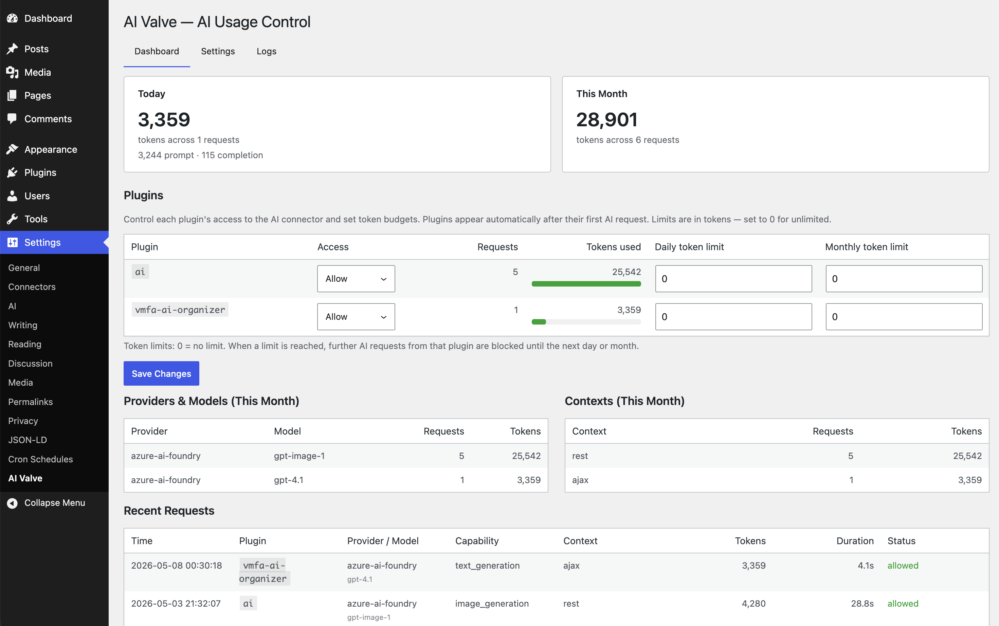

# AI Valve

Control, meter, and permission-gate AI usage from plugins that connect through the WordPress 7 AI connector.

> Inspired by [WordPress AI Connectors Need More Friction, Not Less](https://thewp.world/wordpress-ai-connectors-need-more-friction-not-less/). Works with WordPress 7 RC2. Tested with [WordPress AI](https://wordpress.org/plugins/ai/), [Virtual Media Folders AI Organizer](https://github.com/soderlind/vmfa-ai-organizer), and [AI Provider for Azure AI Foundry](https://github.com/soderlind/ai-provider-for-azure-ai-foundry).



## Features

- **Per-plugin access control** — Allow or deny individual plugins from making AI requests.
- **Token budgets** — Set daily and monthly token limits per plugin and globally.
- **Context restrictions** — Control which execution contexts (admin, frontend, cron, REST, AJAX, CLI) may trigger AI calls.
- **Usage dashboard** — Token consumption at a glance: summary cards, progress bars, and per-plugin breakdowns.
- **Request logging** — Every AI request is logged with provider, model, capability, tokens, and caller attribution.
- **Budget alerts** — Admin notices and optional email when usage approaches or exceeds limits.
- **Developer hooks** — Filter and action hooks to extend behaviour without modifying the plugin.

## Requirements

- WordPress 7.0+
- PHP 8.3+
- A configured AI provider in **Settings → Connectors**

## Installation


1. Download [`ai-valve.zip`](https://github.com/soderlind/ai-valve/releases/latest/download/ai-valve.zip)
2. Upload via  `Plugins → Add New → Upload Plugin`
3. Activate via `WordPress Admin → Plugins`
4. Configure settings via `Settings → AI Valve`

### From source

```bash
git clone https://github.com/soderlind/ai-valve.git
cd ai-valve
composer install
npm install && npm run build
```

## Usage

After activation, AI Valve intercepts all calls made through `wp_ai_client_prompt()`. Navigate to **Settings → AI Valve**:

- **Dashboard** — Token usage for today and this month, per-plugin access/budget controls, provider breakdown, and recent requests.
- **Settings** — Master switch, default policy, context restrictions, global budgets, and alert configuration.
- **Logs** — Filterable, paginated request log with purge controls.

## How It Works

AI Valve hooks into three WordPress 7 AI connector events:

| Hook | Purpose |
|---|---|
| `wp_ai_client_prevent_prompt` | Gate requests — evaluate policy |
| `wp_ai_client_before_generate_result` | Insert a pending log row with caller attribution |
| `wp_ai_client_after_generate_result` | Update the pending row with token usage and status |

A pending log row is created *before* the AI provider is called. If the provider throws (auth error, timeout, bad deployment), a shutdown handler marks the row as `error` so failed requests are never lost.

Caller attribution uses `debug_backtrace()` to identify which plugin initiated the request.

When a request is blocked the calling plugin receives a `WP_Error` with code `prompt_prevented`. See [docs/how-blocking-works.md](docs/how-blocking-works.md) for the full explanation.

## Developer Hooks

AI Valve exposes hooks so you can extend its behaviour from another plugin or `functions.php` without editing the source.

| Hook | Type | Purpose |
|---|---|---|
| `aivalve_plugin_policy` | filter | Override the allow/deny decision for any plugin |
| `aivalve_request_denied` | action | React when a request is blocked |
| `aivalve_request_completed` | action | React when a request succeeds (token counts available) |

See **[docs/hooks.md](docs/hooks.md)** for signatures, parameter descriptions, and examples.

## FAQ

### How do I block all plugins and only allow specific ones?

1. Go to **Settings → AI Valve → Settings**.
2. Set the **Default policy** to **Deny**.
3. Switch to the **Dashboard** tab.
4. In the **Per-plugin access** table, set each plugin you want to permit to **Allow**.

Everything not explicitly allowed will be denied.

### Can I override the policy programmatically?

Yes — use the `aivalve_plugin_policy` filter. See [docs/hooks.md](docs/hooks.md).

## Development

### Tests

```bash
# PHP (PHPUnit 11 + Brain Monkey)
composer install
vendor/bin/phpunit

# JavaScript (Vitest)
npm install
npx vitest run
```

### Project structure

```
ai-valve.php                    Plugin bootstrap and metadata
uninstall.php                   Cleanup on uninstall
readme.txt                      WordPress.org readme
README.md                       GitHub documentation
CHANGELOG.md                    Release notes
.wordpress-org/                 WordPress.org icons, banners, screenshots
docs/                           Developer documentation
  README.md                     Documentation index
  hooks.md                      Filters/actions reference
  how-blocking-works.md         Blocking flow details
src/
  Plugin.php                    Hook registration orchestrator
  Admin/AdminPage.php           Settings page shell for the React admin app
  Alert/AlertManager.php        Budget threshold notices and email alerts
  Interceptor/
    RequestInterceptor.php      WP 7 AI hook wiring and pending-row logging
    PolicyEngine.php            Allow/deny/context/budget evaluation
    CallerDetector.php          Backtrace to plugin slug attribution
  REST/UsageController.php      REST API endpoints for admin screens
  Settings/Settings.php         Options read/write/sanitize
  Tracking/
    LogRepository.php           Custom DB table CRUD and migrations
    UsageClock.php              Database-aligned date buckets
    UsageTracker.php            Rolling daily/monthly token counters
  js/
    index.js                    React admin entry point
    App.jsx                     Admin app shell and tab routing
    api.js                      REST client wiring
    admin-api.js                Shared JS API helpers
    admin.css                   Admin UI styles
    components/                 Dashboard, settings, logs, and tables
build/                          Generated admin assets
tests/
  Unit/                         PHPUnit + Brain Monkey tests
  js/                           Vitest tests
  stubs/                        Test stubs for WordPress AI connector
composer.json                   PHP dependency metadata
package.json                    npm scripts and JS dependencies
phpunit.xml.dist                PHPUnit configuration
vitest.config.mjs               Vitest configuration
```

## Documentation

See [docs/README.md](docs/README.md) for a full index.

## License

GPL-2.0-or-later — see [LICENSE](https://www.gnu.org/licenses/gpl-2.0.html).
